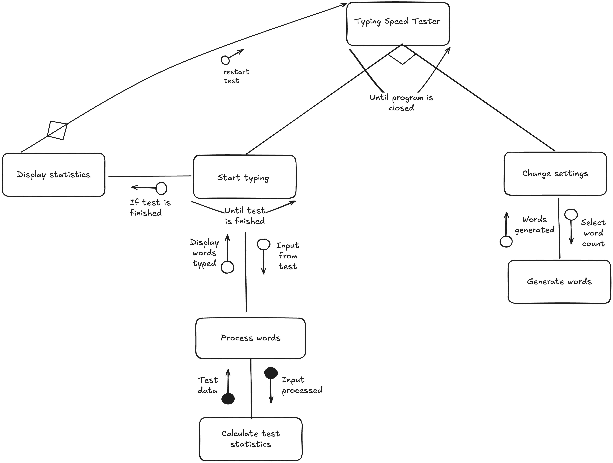
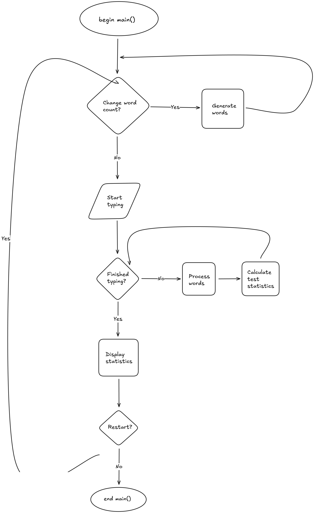

# 11SE Task 2 2025 - Typing Speed Tester
## By Alex

# Sprint 1
## **Requirements Definition**
### **Functional Requirements**
- **Data Retrieval:** What does the user need to be able to view in the system? 

The user needs to be able to view the words for the typing test which has randomised words, which will end once the user has typed the set amount of words words. The system will then gather the data from the user's test and calculate the WPM (Words Per Minute) from it.

- **User Interface:** What is required for the user to interact with the system?

They need to be able to type the displayed words so that they can test their typing skills. There will also be an option to select the amount of words the user wants to do, and the default will be 25. If the user makes an error during the typing test, they will lose accuracy. There will also be an exit button on the UI or on the window.

- **Data Display:** What information does the user need to obtain from the system? What needs to be output for the user?

The user will get their results for the typing test. It will show their WPM from the typing test that they completed, as well as how long it took them to type all of it.

### **Non-functional Requirements**
- **Performance:** How well does the system need to perform? 

The system needs to be able to register the input from the user without a big delay for a quick measurement when calculating the results from the user's test.

- **Reliability:** How reliable does the system and data need to be?

The program needs to be fully reliable, as any innacuracies when gathering the data will result an inaccurate display of the WPM.

- **Usability and Accessibility:** How easy to navigate does the system need to be? What instructions will we need for users to access the system?

The system navigation needs to be easy to use with minimalistic design featuring the main parts of the test as well as other elements. There will also be a guide on how to use the program within the README.md file.

## **Determining Specifications**
### **Functional Specifications**
- **User Requirements**
    - What does the user need to be able to do? List all specifications here.

The user needs to be able to start the test, write the displayed words, which then they will recieve their feedback. The system should be easy to use and allow the user to reset or exit the test whenever it is needed.

- **Inputs & Outputs**
    - What inputs will the system need to accept and what outputs will it need to display?

In the test, the user will take the keyboard's input from the user as they do the test, and will display statistics while the user is typing, such as time passed during the test or words typed, etc.

- **Core Features**
    - At its core, what specifically does the program need to be able to do?

The essential features that the program needs to are displaying the passage of text, show the statistics while doing the test, and calculate the inputs from the user and clearly display the results on the graphical user interface (GUI).

- **User Interaction**
    - How will users interact with the system (e.g. command-line, GUI?) and what information will it need to provide to help users navigate?

Users will interact with the program with a GUI with clear navigation, where they are able to complete the test and view their results on how well they did.

- **Error Handling**
    - What possible errors could you face that need to be handled by the system?

Some errors that can happen in the program include empty inputs, not following the specified words for the test, etc. The program must be able to handle these problems without breaking the whole system as it would result in a big inconvenience.

### **Non-functional Specifications**
- **Performance**
    - How quickly should we try to get the system to perform tasks, what efficiency is required to maintain user engagement? How can we ensure our program remains efficient?

The system will need to respond instantly to the user's input. A fast system response keeps the users engaged, so the program needs to be optimized to keep it running without delays or any problems.

- **Useability / Accessibility**
    - How might you make your application more accessible? What could you do with the User Interface to improve usability?

To improve accessibility in the program, there could be support such as readable fonts, larger buttons, as well as adding different languages. The usability can be improved by not making the UI too complex and making it a simple design.

- **Reliability**
    - What could perhaps not crash the whole system, but could be an issue and needs to be addressed? Data integrity? Illogical calculation? Menu navigation going to wrong places?

Some minor errors that could happen in the system include innacurate WPM calculations or not getting the raw input from the user. These problems will need to be tested to ensure the program runs smoothly.

### **Use Cases**
- **Actors:** Who interacts with the system (e.g., user, external system).

Someone who wants to test their typing skills using the application.

- **Preconditions:** Conditions that must be met before the use case starts.

The application needs to be open and running, with the words for the test loaded and ready to be started.

- **Main Flow:** The step-by-step process of how the interaction occurs.

1. The user opens the application
2. They select the configurations for the test.
3. They start typing after the words are loading.
4. The system collects the data from the typing and calculates the analytics.
5. After the user finishes, the data gathered from the test is displayed.

**Postconditions:** The expected outcome or result after the use case is completed.

The user is given results on their test, and is met with two buttons which either restart or exit the test.

## **Design**


### **Data Flow Diagrams**
#### Level 0


#### Level 1


### **Gantt Chart**


## **Build and Test**
### **AlxType.py**
```
"""
Import modules
"""
import tkinter as tk
import ttkbootstrap

"""
Display the 'WPM' when run
"""
def get_wpm():
    wpm = ttkbootstrap.Label(
        text="great typing, your wpm is 9999!!", # It's too early to implement a working feature, so this is what will do for now.
    )
    wpm.pack(pady=5)

"""
Create the GUI for the test
"""
root = ttkbootstrap.Window(themename="superhero") # A theme for all of the text, buttons, etc. (using ttkbootstrap)
root.title("AlxType")
root.geometry("1600x900") # How big the window will start when launched (yes, it's resizable)

"""
Create the title
"""
title = ttkbootstrap.Label(
    text="AlxType",
)
title.pack(pady=5)

"""
The prompt for the user to type
"""
prompt = ttkbootstrap.Label(
    text="Type: shawn fan is a very cute boy who is good at maths",
)
prompt.pack(pady=5)

"""
An input box so the user can type the words
"""
word_input = ttkbootstrap.ScrolledText(
    width=25,
    height=5,
)
word_input.pack(pady=10)

"""
A submit button that gets the WPM when pressed
"""
submit_input = ttkbootstrap.Button(
    text="Submit",  
    command=get_wpm, # This is the command that displays the word count
    bootstyle="outline button"
)
submit_input.pack()

"""
Start the GUI until closed
"""
root.mainloop()
```

## **Review**
1. **Evaluate**

Right now, the program is just a very simple GUI, acting as a foundation for future improvements. Currently, users are able to submit the words that are typed, adhering to the prompt that is displayed above the text box, which fufils the basic funcitonal and non-functional requirements that was mentioned earlier.

2. **Analyse**

The program is performing well, it just needs to be improved upon during the next sprints. Currently, the program cannot calculate the WPM, so it just displays a text after the user submits the test, following the use-case, and handling the input and output well.

3. **Assess**

As for the code structure, it is well-written and coherent. The comments accurately label what the code is doing, and is structured well with lines seperating different parts of the code. The variables are named accurately, and overall, the code is structured neatly.

4. **Explain**

In the future, the WPM calculation will actually be implemented along with some GUI features, improving the aestethic of the program and improving the user's experience. There can also be some added features to the code structure, such as the comments being more detailed.

## **Launch**
### **README.MD**
```
# AlxType
## Overview
Welcome to this program, where you can test your typing speed by typing a prompt of words to determine your WPM (Words Per Minute), to see how fast your typing skills are (the higher the better).

## Installation
To run the program, just download the latest release on the GitHub (it may take some time to launch, so be patient!). If you want use it with the source code (unpackaged), run the command `pip install -r requirements.txt` in the terminal/command prompt with the folder navigated to. This will install the dependencies needed for running the program, which you can then run the program (preferably in a code editor such as VSCode).
```

### **requirements.txt**
```ttkbootstrap```

# Sprint 2
## **Design**
### Structure Chart


### Flowchart


### Psuedocode
```
BEGIN root.mainloop()
    IF New test requested THEN
        Generate words
    ENDIF

    UNTIL user has finished typing all words OR user quits:
        Process input
        Update display
    
    DISPLAY Test statistics  
END root.mainloop()
```

## **Build and Test**
### **AlxType.py**
```
from tkinter import messagebox
import tkinter as tk
import ttkbootstrap
import time
import random

# global variables
start_time = None

# load words from the 'wordlist.txt' file
with open("wordlist.txt", "r") as f:
    words = [line.strip() for line in f if line.strip()]

def validate_entry(text):
    """
    Only allows numbers.
    """
    return text.isdecimal()

def start_test():
    """
    Starts the typing test. It gets the amount of words from the input,
    generates them and prepares for the user to start typing.
    """
    global test_words, start_time

    try:
        count = int(entry.get())
    except ValueError:
        messagebox.showwarning("Error", "Please enter a valid number of words.")
        entry.config(state="normal") # 
        entry.delete(0, tk.END)
        entry.focus()
        return

    if count > len(words):
        messagebox.showwarning("Error", f"Not enough words in the list. Please enter a number up to {len(words)}.")
        entry.config(state="normal")
        entry.delete(0, tk.END)
        entry.focus()
        return

    # select random words for the test
    test_words = random.sample(words, count)
    word_display.config(text=" ".join(test_words))

    # reset the input box
    word_input.config(state="normal")
    word_input.delete(0, tk.END)
    word_input.focus()

    # record the start of the test
    start_time = time.time()

def end_test():
    """
    Ends the typing test, calculates WPM, and displays the results.
    """
    if not test_words or start_time is None:
        messagebox.showwarning("Error", "Start the test first.")
        return

    typed_text = word_input.get().strip()
    typed_words = typed_text.split()

    total_typed = len(typed_words)

    elapsed = time.time() - start_time
    # calculate WPM
    wpm = round((total_typed / elapsed) * 60) if elapsed > 0 else 0

    # display the test results
    word_display.config(
        text=f"Test complete!\nWPM: {wpm}"
    )
    # disable the input of words
    word_input.config(state="disabled")

# GUI setup
# create the main window using ttkbootstrap
root = ttkbootstrap.Window(themename="superhero")
root.title("AlxType - Typing Speed Test")
root.geometry("1600x900")

# title Label
title = ttkbootstrap.Label(
    text="AlxType",
)
title.pack(pady=10)

# instructions Label
instructions = ttkbootstrap.Label(
    text="Enter the number of words for the test:",
)
instructions.pack(pady=10)

# entry widget for the user to input only numbers
entry = ttkbootstrap.Entry(
    validate="key",
    validatecommand=(root.register(validate_entry), "%S"), # makes sure only decimal numbers are entered
    width=10
)
entry.pack(pady=10)

# button to start the test
word_gen = ttkbootstrap.Button(
    text="Generate Words",
    command=start_test,
)
word_gen.pack(pady=10)

# label to display the words for typing
word_display = ttkbootstrap.Label(
    text="Words will appear here...",
    wraplength=1400, # wraps text
)
word_display.pack(pady=25, padx=50)

# entry widget for the user to type the words
word_input = ttkbootstrap.Entry(
    width=50,
    state="disabled" # unable to type until test starts
)
word_input.pack(pady=10)

# button to end the test
submit_input = ttkbootstrap.Button(
    text="Get WPM",
    command=end_test,
)
submit_input.pack(pady=10)

# loops the program
root.mainloop()
```
## **Review**
1. **Evaluate**

There has been a lot of progress in the functions of the application. It meets the functional and non-functional requirements as it can calculate the WPM (it took a lot of research to implement). There will need to be some more user-experience improvements and visual improvements, as well as adding the accuracy feature.

2. **Analyse**

The program works well, it just needs to be polished during the next sprints. Currently, the program can calculate the WPM, following the user case, and handling the input and output well.

3. **Assess**

The code structure is clear to read and analyse. The docstrings and comments show what the code is doing, and is structured well with lines seperating different parts of the code. The variables are named mostly correctly (there could be some changes in the future), and the code is optimised.

4. **Explain**
Since most of the core features have been made, there may be some bugs and features that need to be fixed/implemented (especially adding classes). One example of this could be finish adding an accuracy feature. The code could be optimised too, making the program more efficient.

## **Launch**
### **README.md**
```
# AlxType
## Overview
Welcome to this program, where you can test your typing speed by typing a prompt of words to determine your WPM (Words Per Minute), to see how fast your typing skills are (the higher the better).

## Installation
To run the program, you will need to download python (the latest versions is recommended). After, download the .zip file of this (you can see from the green button), then extract it and open it. Run the command `pip install -r requirements.txt` in the terminal/command prompt with the folder navigated to. This will install the dependencies needed for running the program, which you can then run the program (preferably in a code editor such as VSCode). The other modules already come with Python, so there is no need to install them.
```

# Sprint 3
## **Design**

## **Build and Test**

## **Review**

## **Launch**

# Sprint 4
## **Design**

## **Build and Test**

## **Review**

## **Launch**