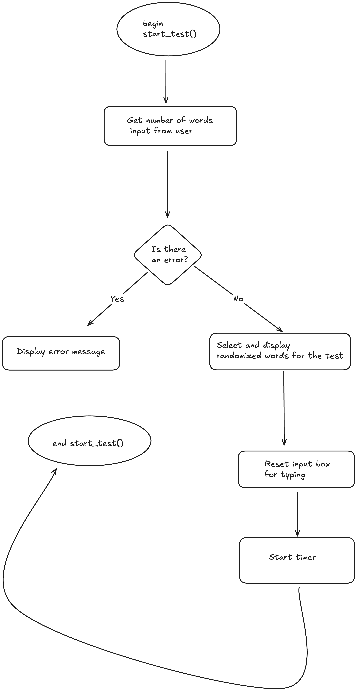
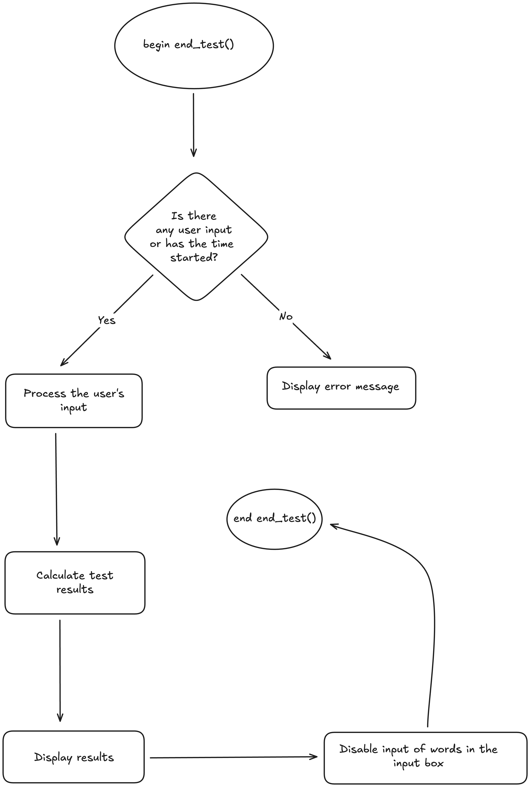
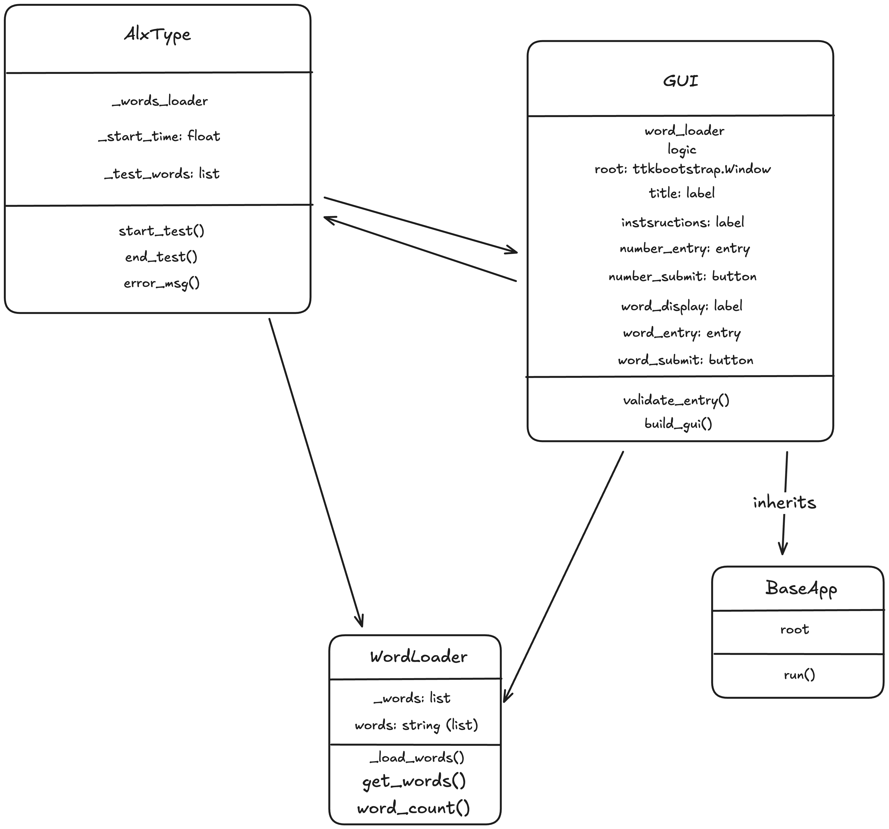
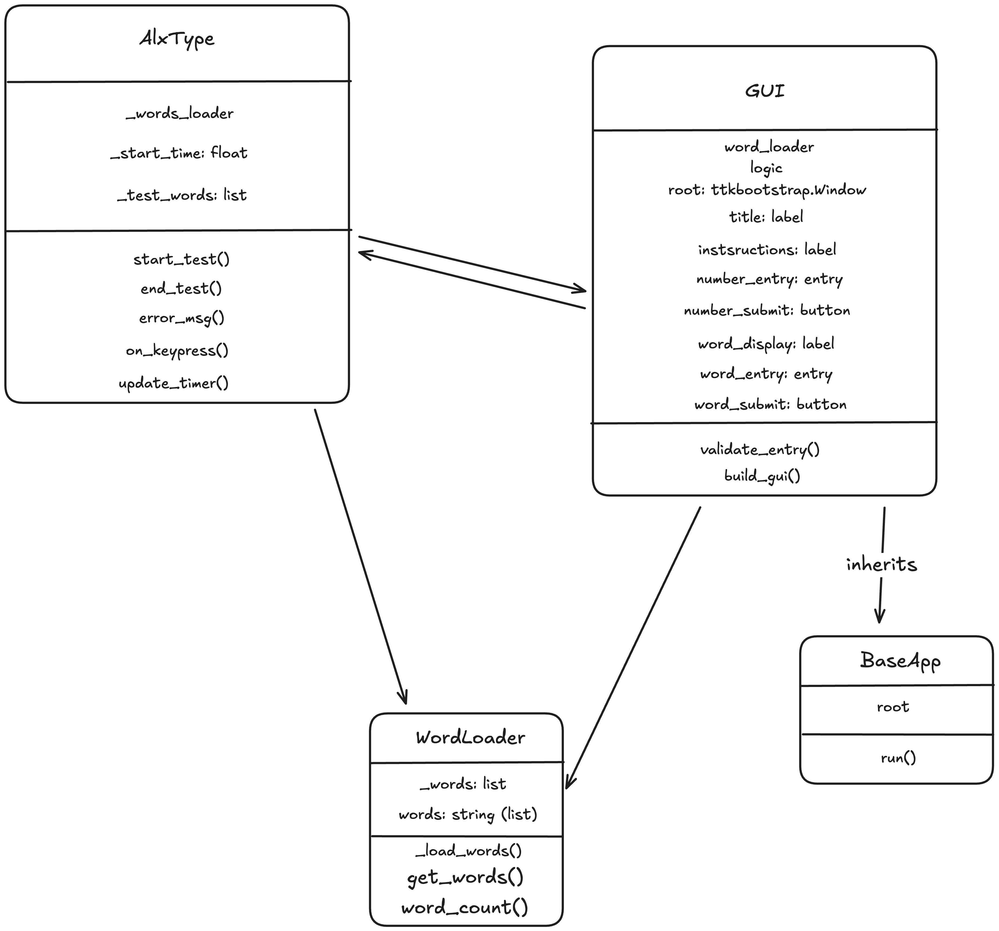

# 11SE Task 2 2025 - Typing Speed Tester
## By Alex

# Sprint 1
## **Requirements Definition**
### **Functional Requirements**
- **Data Retrieval**

The user needs to be able to view the words for the typing test which has randomised words, which will end once the user has typed the set number of words. The system will then gather the data from the user's test and calculate the WPM (Words Per Minute) from it.

- **User Interface**

They need to be able to type the displayed words so that they can test their typing skills. There will also be an option to select the number of words the user wants to do, and the default will be 25. If the user makes an error during the typing test, they will lose accuracy. There will also be an exit button on the UI or on the window.

- **Data Display**

The user will get their results for the typing test. It will show their WPM from the typing test that they completed, as well as how long it took them to type all of it.

### **Non-functional Requirements**
- **Performance**

The system needs to be able to register the input from the user without a big delay for a quick measurement when calculating the results from the user's test.

- **Reliability**

The program needs to be fully reliable, as any inaccuracies when gathering the data will result an inaccurate display of the WPM.

- **Usability and Accessibility**

The system navigation needs to be easy to use with minimalistic design featuring the main parts of the test as well as other elements. There will also be a guide on how to use the program within the README.md file.

## **Determining Specifications**
### **Functional Specifications**
- **User Requirements**

The user needs to be able to start the test, write the displayed words, which then they will receive their feedback. The system should be easy to use and allow the user to reset or exit the test whenever it is needed.

- **Inputs & Outputs**

In the test, the user will take the keyboard's input from the user as they do the test, and will display statistics while the user is typing, such as time passed during the test or words typed, etc.

- **Core Features**

The essential features that the program needs to are displaying the passage of text, show the statistics while doing the test, and calculate the inputs from the user and clearly display the results on the graphical user interface (GUI).

- **User Interaction**

Users will interact with the program with a GUI with clear navigation, where they are able to complete the test and view their results on how well they did.

- **Error Handling**

Some errors that can happen in the program include empty inputs, not following the specified words for the test, etc. The program must be able to handle these problems without breaking the entire system as it would result in a big inconvenience.

### **Non-functional Specifications**
- **Performance**

The system will need to respond instantly to the user's input. A fast system response keeps the users engaged, so the program needs to be optimized to keep it running without delays or any problems.

- **Useability / Accessibility**

To improve accessibility in the program, there could be support such as readable fonts, larger buttons, as well as adding different languages. The usability can be improved by not making the UI too complex and making it a plain design.

- **Reliability**

Some minor errors that could happen in the system include inaccurate WPM calculations or not getting the raw input from the user. These problems will need to be tested to ensure the program runs smoothly.

### **Use Cases**
- **Actors**

Someone who wants to test their typing skills using the application.

- **Preconditions**

The application needs to be open and running, with the words for the test loaded and ready to be started.

- **Main Flow**

1. The user opens the application
2. They select the configurations for the test.
3. They start typing after the words are loading.
4. The system collects the data from the typing and calculates the analytics.
5. After the user finishes, the data gathered from the test is displayed.

**Postconditions:** The expected outcome or result after the use case is completed.

The user is given results on their test and is met with two buttons which either restart or exit the test.

## **Design**
### **Storyboard**


### **Data Flow Diagrams**
#### Level 0


#### Level 1


### **Gantt Chart**


## **Build and Test**
### **AlxType.py**
```
"""
Import modules
"""
import tkinter as tk
import ttkbootstrap

"""
Display the 'WPM' when run
"""
def get_wpm():
    wpm = ttkbootstrap.Label(
        text="great typing, your wpm is 9999!!", # It's too early to implement a working feature, so this is what will do for now.
    )
    wpm.pack(pady=5)

"""
Create the GUI for the test
"""
root = ttkbootstrap.Window(themename="superhero") # A theme for all of the text, buttons, etc. (using ttkbootstrap)
root.title("AlxType")
root.geometry("1600x900") # How big the window will start when launched (yes, it's resizable)

"""
Create the title
"""
title = ttkbootstrap.Label(
    text="AlxType",
)
title.pack(pady=5)

"""
The prompt for the user to type
"""
prompt = ttkbootstrap.Label(
    text="Type: shawn fan is a very cute boy who is good at maths",
)
prompt.pack(pady=5)

"""
An input box so the user can type the words
"""
word_input = ttkbootstrap.ScrolledText(
    width=25,
    height=5,
)
word_input.pack(pady=10)

"""
A submit button that gets the WPM when pressed
"""
submit_input = ttkbootstrap.Button(
    text="Submit",  
    command=get_wpm, # This is the command that displays the word count
    bootstyle="outline button"
)
submit_input.pack()

"""
Start the GUI until closed
"""
root.mainloop()
```

## **Review**
1. **Evaluate**

Right now, the program is just a quite simple GUI, acting as a foundation for future improvements. Currently, users can submit the words that are typed, adhering to the prompt that is displayed above the text box, which fulfills the basic functional and non-functional requirements that was mentioned earlier.

2. **Analyse**

The program is performing well. It just needs to be improved upon during the next sprints. Currently, the program cannot calculate the WPM, so it just displays a text after the user submits the test, following the use-case, and handling the input and output well.

3. **Assess**

As for the code structure, it is well-written and coherent. The comments accurately label what the code is doing and is structured well with lines separating various parts of the code. The variables are named accurately, and overall, the code is structured neatly.

4. **Explain**

In the future, the WPM calculation will be implemented along with some GUI features, improving the aesthetics of the program and improving the user's experience. There can also be some added features to the code structure, such as the comments being more detailed.

## **Launch**
### **README.MD**
```
# AlxType
## Overview
Welcome to this program, where you can test your typing speed by typing a prompt of words to determine your WPM (Words Per Minute), to see how fast your typing skills are (the higher the better).

## Installation
To run the program, just download the latest release on the GitHub (it may take some time to launch, so be patient!). If you want use it with the source code (unpackaged), run the command `pip install -r requirements.txt` in the terminal/command prompt with the folder navigated to. This will install the dependencies needed for running the program, which you can then run the program (preferably in a code editor such as VSCode).
```

### **requirements.txt**
```ttkbootstrap```

# Sprint 2
## **Design**
### **Structure Chart**


### **Flowchart**
#### **Main Process**


```
BEGIN root.mainloop()
    IF New test requested THEN
        Generate words
    ENDIF

    UNTIL user has finished typing all words OR user quits:
        Process input
        Update display
    
    DISPLAY Test statistics  
END root.mainloop()
```

#### **start_test()**


```
BEGIN start_test()
    GET no. of words input from user

    IF error:
        DISPLAY error message

        ELSE:  
            SELECT and DISPLAY randomized words for the test
            RESET input box for typing
            START timer
    ENDIF

END start_test()
```

#### **end_test()**


```
BEGIN end_test()
    IF any user input/time has been started:
        PROCESS user's input
        CALCULATE test results
        DISPLAY results
        DISABLE INPUT of words
    
        ELSE:
            DISPLAY error message

    ENDIF
END end_test()
```

## **Build and Test**
### **AlxType.py**
```
from tkinter import messagebox
import tkinter as tk
import ttkbootstrap
import time
import random

# global variables
start_time = None

# load words from the 'wordlist.txt' file
with open("wordlist.txt", "r") as f:
    words = [line.strip() for line in f if line.strip()]

def validate_entry(text):
    """
    Only allows numbers.
    """
    return text.isdecimal()

def start_test():
    """
    Starts the typing test. It gets the amount of words from the input,
    generates them and prepares for the user to start typing.
    """
    global test_words, start_time

    try:
        count = int(entry.get())
    except ValueError:
        messagebox.showwarning("Error", "Please enter a valid number of words.")
        entry.config(state="normal") # 
        entry.delete(0, tk.END)
        entry.focus()
        return

    if count > len(words):
        messagebox.showwarning("Error", f"Not enough words in the list. Please enter a number up to {len(words)}.")
        entry.config(state="normal")
        entry.delete(0, tk.END)
        entry.focus()
        return

    # select random words for the test
    test_words = random.sample(words, count)
    word_display.config(text=" ".join(test_words))

    # reset the input box
    word_input.config(state="normal")
    word_input.delete(0, tk.END)
    word_input.focus()

    # record the start of the test
    start_time = time.time()

def end_test():
    """
    Ends the typing test, calculates WPM, and displays the results.
    """
    if not test_words or start_time is None:
        messagebox.showwarning("Error", "Start the test first.")
        return

    typed_text = word_input.get().strip()
    typed_words = typed_text.split()

    total_typed = len(typed_words)

    elapsed = time.time() - start_time
    # calculate WPM
    wpm = round((total_typed / elapsed) * 60) if elapsed > 0 else 0

    # display the test results
    word_display.config(
        text=f"Test complete!\nWPM: {wpm}"
    )
    # disable the input of words
    word_input.config(state="disabled")

# GUI setup
# create the main window using ttkbootstrap
root = ttkbootstrap.Window(themename="superhero")
root.title("AlxType - Typing Speed Test")
root.geometry("1600x900")

# title Label
title = ttkbootstrap.Label(
    text="AlxType",
)
title.pack(pady=10)

# instructions Label
instructions = ttkbootstrap.Label(
    text="Enter the number of words for the test:",
)
instructions.pack(pady=10)

# entry widget for the user to input only numbers
entry = ttkbootstrap.Entry(
    validate="key",
    validatecommand=(root.register(validate_entry), "%S"), # makes sure only decimal numbers are entered
    width=10
)
entry.pack(pady=10)

# button to start the test
word_gen = ttkbootstrap.Button(
    text="Generate Words",
    command=start_test,
)
word_gen.pack(pady=10)

# label to display the words for typing
word_display = ttkbootstrap.Label(
    text="Words will appear here...",
    wraplength=1400, # wraps text
)
word_display.pack(pady=25, padx=50)

# entry widget for the user to type the words
word_input = ttkbootstrap.Entry(
    width=50,
    state="disabled" # unable to type until test starts
)
word_input.pack(pady=10)

# button to end the test
submit_input = ttkbootstrap.Button(
    text="Get WPM",
    command=end_test,
)
submit_input.pack(pady=10)

# loops the program
root.mainloop()
```
## **Review**
1. **Evaluate**

There has been a lot of progress in the functions of the application. It meets the functional and non-functional requirements as it can calculate the WPM (it took a lot of research to implement). There will need to be some more user-experience improvements and visual improvements, as well as adding the accuracy feature.

2. **Analyse**

The program works very nicely, but it just needs to be polished during the next sprints. Currently, the program can calculate the WPM, follow the use case, and handle the input and output well.

3. **Assess**

The code structure is clear to read and analyse. The docstrings and comments show what the code is doing and is structured well with lines separating various parts of the code. The variables are named mostly correctly (there could be some changes in the future), and the code is optimised.

4. **Explain**
Since most of the core features have been made, there may be some bugs and features that need to be fixed/implemented (especially adding classes). One example of this could be finish adding an accuracy feature. The code could be optimised too, making the program more efficient.

## **Launch**
### **README.md**
```
# AlxType
## Overview
Welcome to this program, where you can test your typing speed by typing a prompt of words to determine your WPM (Words Per Minute), to see how fast your typing skills are (the higher the better).

## Installation
To run the program, you will need to download python (the latest versions is recommended). After, download the .zip file of this (you can see from the green button), then extract it and open it. Run the command `pip install -r requirements.txt` in the terminal/command prompt with the folder navigated to. This will install the dependencies needed for running the program, which you can then run the program (preferably in a code editor such as VSCode). The other modules already come with Python, so there is no need to install them.
```

# Sprint 3
## **Design**
### **UML Class Diagram**


## **Build and Test**
```
from tkinter import messagebox
import tkinter as tk
import ttkbootstrap
import time
import random

class WordLoader:
    """
    Loads and validates words from wordlist.txt.
    """
    def __init__(self, filepath):
        self._words = self._load_words(filepath)

    def _load_words(self, filepath):
        with open(filepath, "r") as shawn_fan_is_very_cute:
            return [line.strip() for line in shawn_fan_is_very_cute if line.strip()] 

    def get_words(self, count):
        if count > len(self._words):
            raise ValueError(f"Maximum allowed words: {len(self._words)}") # error msg
        return random.sample(self._words, count)

    def word_count(self):
        return len(self._words)

class AlxType:
    """
    Manages the main functions, such as word generation and statistics,
    and also handles the interaction logic between the GUI and data.
    """
    def __init__(self, words_loader, gui):
        self._words_loader = words_loader
        self._start_time = None
        self._test_words = []
        self.gui = gui

    def start_test(self):
        count_str = self.gui.number_entry.get()
        if not count_str.isdigit():
            messagebox.showerror("Error", "Please enter a valid number")
            return

        count = int(count_str)
        max_words = self._words_loader.word_count()

        if count > max_words:
            messagebox.showerror("Error", f"Maximum allowed words: {max_words}")
            return

        self._test_words = self._words_loader.get_words(count)
        self._start_time = time.time()

        self.gui.word_display.config(text=" ".join(self._test_words)) # adds the test words
        self.gui.word_entry.config(state="normal")
        self.gui.word_entry.delete(0, tk.END)
        self.gui.word_entry.focus()

    def end_test(self):
        typed_text = self.gui.word_entry.get()
        elapsed = time.time() - self._start_time
        typed_words = typed_text.strip().split()
        wpm = round(len(typed_words) / elapsed * 60) if elapsed > 0 else 0 # wpm calculation

        messagebox.showinfo("Results", f"Your typing speed is {wpm} WPM")

        self.gui.word_entry.config(state="disabled")
        self.gui.number_submit.config(state="normal")
        self.gui.input_submit.config(state="disabled")

class BaseApp:
    """
    Base GUI window.
    """
    def __init__(self):
        self.root = ttkbootstrap.Window(themename="superhero")
        self.root.title("AlxType")
        self.root.geometry("1600x900")

    def run(self):
        self.root.mainloop()

class GUI(BaseApp):
    """
    Main app that combines the other classes.
    """
    def __init__(self):
        super().__init__()
        self.word_loader = WordLoader("wordlist.txt")
        self.logic = AlxType(self.word_loader, self)
        self.build_gui()

    def validate_entry(self, text):
        return text.isdecimal() # command for number-only input

    def build_gui(self):
        """
        Creates all of the widgets for the GUI.
        """
        self.title = ttkbootstrap.Label(
            self.root,
            text="AlxType"
            )
        self.title.pack(pady=10)

        self.instructions = ttkbootstrap.Label(
            self.root,
            text="Enter any amount of words."
            )
        self.instructions.pack(pady=10)

        self.number_entry = ttkbootstrap.Entry(
            self.root,
            validate="key",
            validatecommand=(self.root.register(self.validate_entry), "%P"), # number-only input
            width=10
        )
        self.number_entry.pack(pady=10)

        self.number_submit = ttkbootstrap.Button(
            self.root,
            text="Generate Words",
            command=self.logic.start_test # command for starting the test
        )
        self.number_submit.pack(pady=10)

        self.word_display = ttkbootstrap.Label(
            self.root,
            text="Words will appear here...",
            wraplength=1400
        )
        self.word_display.pack(pady=25, padx=50)

        self.word_entry = ttkbootstrap.Entry(
            self.root,
            width=50,
            state="disabled"
        )
        self.word_entry.pack(pady=10)

        self.input_submit = ttkbootstrap.Button(
            self.root,
            text="Get WPM",
            command=self.logic.end_test # command for ending the test
        )
        self.input_submit.pack(pady=10)

GUI().run()
```

## **Review**
1. **Evaluate**

All the code has been successfully implemented to use OOP fundamentals, including most of its features like inheritance, encapsulation, etc. It still includes all the features that were implied in the functional and non-functional requirements, making all the criteria good. All that's left to do is make the program look better and add some more features (including accuracy calculation).

2. **Analyse**

When running the program, it almost all the input and output as planned. If there is an error, for example trying to generate more words than the wordlist has, it will give a messagebox error and clear the input so the user can retry. It also handles the output by correctly calculating the WPM, although the time starts when the words are generated, not when the user starts the typing (which will be fixed in Sprint 4). Therefore, the program handles most of the input and output, there just need to be some small fixes and updates.

3. **Assess**

Like the other sprints, the code is well organised and has been improved by renaming the variables and making it more readable. The docstrings clearly highlight what the class is doing, and the comments inform specific lines of code, maintaining a clear readability factor and being coherent.

4. **Explain**

There isn't much to do for the code structure as there will not need to be any improvements, what is needed is just adding the last few features in Sprint 4 and updating the GUI, which is more important. As for that, everything is going well.

## **Launch**
### **README.md**
```
# AlxType

**AlxType** is a Python-based application with a simple GUI built using `ttkbootstrap`. It measures your typing speed (in words per minute) based on a randomly generated prompt selected from a list.

## Features

- Clean GUI interface
- Random word generation to ensure different scenarios
- Easy to use and extend

## Guide

1. To run the application, you need to clone or download this repository. You can do this by clicking the green button and downloading the zip.

2. Extract the file.

3. Install the required repositories. You can do this by going to the terminal of the root folder and entering the command `pip install -r requirements.txt`.

4. Run the program. You can enter the command `python AlxType.py' or running it in a code editor (such as Visual Studio Code).
```

# Sprint 4
## **Design**
### **Potential Enhancements**
Although most of the core features have already been implemented, there is still room for some extra improvements. One of the key features that will be implemented in this sprint is adding an accuracy feature, as well as some other small features. This includes more important things like language support, releases for multiple operating systems (so the application is computer-friendly), etc.

### **Integration Process**
Most of the features that were suggested can be built in the AlxType logic and GUI structure, which already handle input, output, and display. There won't be any need to rewrite the core structure, as the features can be added by extending the methods and adding new ones. For example, if there was a difficulty feature, there would be multiple wordlists (or maybe an API for different words), and an option for the user to choose which difficulty.

### **Update**
#### **UML**


There was nothing different except `on_keypress()` and `update_timer()` being added for the improvements mentioned in Sprint 3. The structure chart did not have anything that was needed to be changed, as the process was still the same.

## **Build and Test**
No need to paste the code here, you can view it in `AlxType.py` (since it is the final commit anyway) :)

## **Review**
1. **Evaluate**

After all the programming and debugging, it is safe to say that the final code meets all the functional and non-functional requirements. The user can effectively view the data and can easily interact with it, as well as viewing the output from the system. The system performs exceptionally well, making instant calculations without any delay, as well as being reliable during the calculations.

2. **Analyse**

The program behaves as expected and handles input and output as planned. If there are any errors, it will display them to the user, so they know what to do. It can accurately do the said process without any problems (generating words, calculating statistics, etc.).

3. **Assess**

There has certainly been a noticeably big improvement in terms of the code structure and readability over that past few sprints, improving the code bit by bit as time passes. The code in the program is easy to understand, especially with the docstrings and comments, which accurately highlight what is happening, making even someone with little knowledge about Python know what's going on.

4. **Explain**

Since this is the last sprint, all the needed features have been already added, and the only option going forward is to improve and add features, which examples of have already been mentioned above.

## **Launch**
Again, no need to past it in here as it the context is already in `README.md` and `requirements.txt`

## **Evaluation of System**
1. a) **Future Updates**

In future updates, there could need to be some extra feature improvements and accessibility additions for a wider range of people, such as adding support to people who speak different languages. As of right now, the program only loads and tests words using wordlist.txt, which is in English. By improving upon this feature, users could select what language (corresponding to a language file), such as Chinese, Spanish, etc., and the system would load a wordlist depending on their choice. To support this, the class `WordLoader` would be modified to load different language files, such as `wordlist_cn.txt` for someone who would want to have a Chinese typing test. This could also be said about the GUI, where all the text is changed to the language.

1. b) **Impacts**

In this feature, there are both positive and negative impacts. For the positive results, more users can access the system and enhance their typing skills in another language, which can be particularly important to people, such as people learning new languages. With great power comes with great responsibility, because it may be complex, meaning the UI could become very cluttered if not designed carefully, making the process exceedingly long to implement.

2. **Criteria**

When the final program was compared to the original functional and non-functional requirements, the system meets majority of the specified criteria. In terms of the functional requirements, the system allows users of the program to view a select number of randomly generated words, type them in a GUI, and view the results. As for the non-functional requirements, the system performs extremely well in terms of responsiveness. The user's input is registered without any delay, and the timing functions are accurate and consistent. The usability is also strong due to the GUI layout, and instructions are in the `README.md` file as said. However, the system doesn't support any major accessibility features, which would be important for users who have specific needs. Additionally, there is still some risk of some errors, for example, typing extra spaces or not adhering to word capitalisation could affect the accuracy of the score. Nevertheless, the system matches closely with the specifications but needs a little extra room improvement for some minor features.

### **Project Management**

The overall management of the process was based on a Gantt chart, which helped break down tasks and setting an accurate milestone for each sprint. To be honest, the project was underestimated in terms of difficulty, and I did not notice how hard it would be until I started building the core features (yes, I still had time to implement them). My commit history from earlier shows that I took things slowly at the start and picked up the pace within the last few weeks.

### **Peer Evaluation**

| Peer   | Plus                                      | Minus                                | Implication                                            |
| ------ | ----------------------------------------- | ------------------------------------ | ------------------------------------------------------ |
| Shawn | When looking at the code, it felt coherent and was simple to read, which makes it easy to add features in the future. | Unfortunately, there was no accessibility features implemented, but it could be added considering the good code structure. | The program is good for quick tests and as a baseline for adding features, but it is not for a wide range of people (until added). |
| Victor | I really liked the random word generator and its fast reaction time, as it calculated the statistics extremely fast, making feel very responsive. | I believe the program could use a bit more visual improvements and options, such as changing theme in the UI, not the code. | The application felt very functional and efficient, but it does not have much customizability, which is important to a lot of users. |

5. **OOP Features**

The system's use of OOP was an important part of the project, as it achieved a simple and maintainable structure that could be improved upon. The `WordLoader` class is an example of the use of encapsulation (also used in other parts of the code), where its job was to load and store a list of words (`wordlist.txt`), while making its functions inaccessible to the other parts of the code. This feature allows more customizability to do things like switching to a different word list, without affecting any other pieces of code. The `AlxType` class is a good case of using abstraction, where it manages the core features of the program, such as starting and ending the test. This means the rest of the system doesn't need to make any calculations, as it gets the definitions from the class and displays it. Inheritance is applied in the `BaseApp` and `GUI` classes, where `GUI` is a child of `BaseApp`, which takes care of settings up the main window and making the default font. This avoids any duplication of the code and allows the settings to be configured in one place. The program also shows normalisation, where different responsibilities are split into their corresponding classes. `WordLoader` handles the external file loading, `AlxType` handles data processing and calculation, and the `BaseApp` and `GUI` classes handle the (you guessed it) GUI. This feature is good for the readability and any future changes of the code, for example adding some new GUI improvements won't destory any of the WPM and accuracy calculations. Although polymorphism wasn't implemented in the code, the structure allows for future improvements, such as a subclass of `AlxType` being used for different testing modes, where it could change `end_test()` without affecting the other parts of the system. In summary, although this type of program wasn't the best choice to implement OOP fundamentals, the code was successfuly transferred to implement as much OOP features that it could include. Encapsulation protects data and keeps it safe from being accessed by other parts of the code, abstraction focuses on making the code work so it can be used correctly, inheritance makes sure that it isn't reused, and normalisation, where it makes the code easier to modify without breaking anything else. 